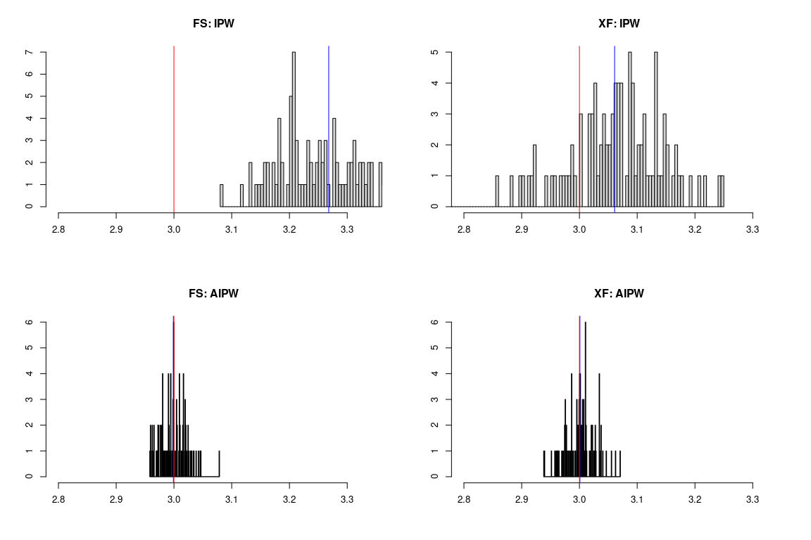

Semiparametric Difference in Differences Estimators using the LASSO
================
Apoorva Lal


The Abadie (2005) semiparametric IPW estimator for the 2-period ATT is

$$
\hat{\tau}^{\text{IPW}} = \frac{1}{N} \sum_i \frac{Y_i(1) - Y_i(0)}{P(D=1)} \frac{D
- \hat{e}(X_i)}{1 - \hat{e}(X_i)}
$$

The Chang (2020) double-robust AIPW estimator is 

$$
\hat{\tau}^{\text{AIPW}} = \frac{1}{N} \sum_i 
\frac{Y_i(1) - Y_i(0)}{P(D=1)} \frac{D - \hat{e}(X_i)}{1 - \hat{e}(X_i)} -
\frac{D - \hat{e}(X_i)}{P(D = 1) (1- \hat{e}(X_i) )} \hat{\mathcal{l}}(X_i, D = 0)
$$

where $\hat{e}(\cdot)$ is the propensity score and
$\hat{\mathcal{l}}(\cdot)$ is an outcome model for $Y(1) - Y(0)$
regressed on covariates in the untreated subsample. Both these functions are estimated using LASSO(`glmnet`).

## DGP

``` r
library(LalRUtils)
libreq(glmnet, knitr)
set.seed(666)
source("R/spDID.R")

# %% # DGP
simstudy = \(N=200, p=100, s=5, theta=3){
    γ=c(s:1,rep(0,(p-s)))/s
    X=array(rnorm(N*p,0,1),dim=c(N,p))
    pr = 1/(1+exp(-X%*%γ))
    D  = rbinom(N,1,pr)
    beta1 = γ+0.5; beta2 = γ+1;
    # potential outcomes
    ε1 = rnorm(N,0,0.1); ε2 = ε3 = ε1
    Y11=Y01=Y00=rep(NA, N)
    Y00 = X %*% beta1 + ε1
    Y01 = Y00 + 1 + ε2
    Y11 = theta + Y01 +ε3
    # outcomes at two time periods
    Y0 = Y00
    Y1 = Y01*(1-D) + Y11*D
    data.frame(Y1, Y0, D, X)
}
```


``` r
B = 100

tauhats1 = mcReplicate(B, {
    df = simstudy()
    ipwDID(df[, -(1:3)] %>% as.matrix(), df$D, df$Y1, df$Y0, xfit = F)
  }, mc.cores = 8)

tauhats2 = mcReplicate(B, {
    df = simstudy()
    ipwDID(df[, -(1:3)] %>% as.matrix(), df$D, df$Y1, df$Y0, xfit = T)
  }, mc.cores = 8)

tauhats3 = mcReplicate(B, {
    df = simstudy()
    aipwDID(df[, -(1:3)] %>% as.matrix(), df$D, df$Y1, df$Y0, xfit = F)
  }, mc.cores = 8)

tauhats4 = mcReplicate(B, {
    df = simstudy()
    aipwDID(df[, -(1:3)] %>% as.matrix(), df$D, df$Y1, df$Y0, xfit = T)
  }, mc.cores = 8)
```

## results

``` r
θ = 3
ests = c(tauhats1, tauhats2, tauhats3, tauhats4)
bounds = quantile(ests, c(0.05, 0.95))
lb = min(2.8, bounds[1]); ub = max(3.2, bounds[2])

par(mfrow = c(2, 2))
hist(tauhats1, breaks=100, main="FS: IPW", xlab="", ylab="", xlim = c(lb, ub))
abline(v = mean(tauhats1), col = 'blue'); abline(v = θ, col = 'red')
hist(tauhats2, breaks=100, main="XF: IPW",     xlab="", ylab="", xlim = c(lb, ub))
abline(v = mean(tauhats2), col = 'blue'); abline(v = θ, col = 'red')

hist(tauhats3, breaks=100, main="FS: AIPW",    xlab="", ylab="", xlim = c(lb, ub))
abline(v = mean(tauhats3), col = 'blue'); abline(v = θ, col = 'red')
hist(tauhats4, breaks=100, main="XF: AIPW",    xlab="", ylab="", xlim = c(lb, ub))
abline(v = mean(tauhats4), col = 'blue'); abline(v = θ, col = 'red')
```

<!-- -->


